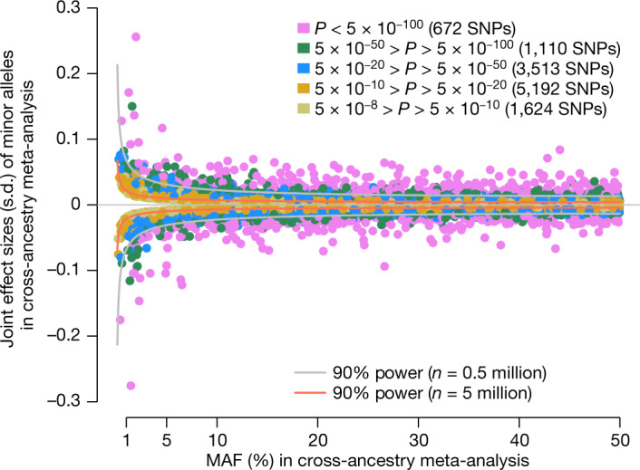

# Motivation

<ul>
<li class="fragment fade-out">In quantitative genetics, an empirical Bayesian linear model is used.
\[
y = \sum_j G_j \beta_j + \varepsilon
\]</li>
<li class="fragment fade-out">How do we determine the prior on \(\beta\)?</li>
</ul>

<ul>
<li class="fragment">Across many complex traits, variants with larger effects tend to be rarer.[^height-paper]</li>
<li class="fragment">A standard statistical description is the \(\alpha\)-model:
\[
\mathrm{Var}(\beta_j \mid p_j) \propto [p_j(1-p_j)]^{-\alpha}.
\]</li>
</ul>

::: {.fragment}
{fig-align="center" height=320}
:::

[^height-paper]: Figure adapted from @Yengo_2022.

## Main idea

::: {.incremental}
- Start from stabilizing selection under Fisher's geometric model (FGM).
- Introduce a focal trait $y$ that is coupled to an unobserved selected trait.
- Derive the induced frequency dependence of $\beta_j$.
- Fit the resulting variance components by REML and compare with $\alpha$-model baselines.
:::

# Evolutionary setup

## Stabilizing selection

::: {.incremental}
- Fitness is modeled as
  $$
  \text{fitness} \propto \exp\left(-\frac{\|z\|^2}{2V_S}\right).
  $$
- For locus $j$ with effect vector $\alpha_j$, the marginal selection coefficient is
  $$
  s_{\mathrm{eff}}(x_j) = \left(x_j - \frac{1}{2}\right)\frac{\|\alpha_j\|^2}{V_S}.
  $$
- This yields a stationary allele-frequency density that depends on $\|\alpha_j\|^2/W_S$.
:::

## From fitness effects to focal-trait effects

::: {.incremental}
- We model the focal-trait variance conditional on the fitness effect by
  $$
  \mathbb{E}[\beta_j^2 \mid \|\alpha_j\|]
  =
  \sigma_b^2 (1-\rho_{ab}^2)
  + \rho_{ab}^2 \frac{\sigma_b^2}{\sigma_a^2}\|\alpha_j\|^2.
  $$
- Here:
  - $\sigma_a^2$ controls mutational variance for the selected trait,
  - $\sigma_b^2$ controls the overall variance scale of the focal trait,
  - $\rho_{ab}^2$ controls coupling between the focal trait and selection.
:::

# Approximate genetic architecture

## Key derivation

::: {.incremental}
- Using Bayes' rule together with the stationary allele-frequency model,
  $$
  p(\|\alpha_j\|^2 \mid G_j)
  \propto
  p(G_j \mid \|\alpha_j\|^2)p(\|\alpha_j\|^2).
  $$
- Under the low-mutation approximation,
  $$
  \mathbb{E}[\|\alpha_j\|^2 \mid G_j]
  =
  \frac{\sigma_a^2}{
    1 + 2\frac{\sigma_a^2}{W_S}\hat p_j(1-\hat p_j)}.
  $$
- Substituting this into the pleiotropy model gives
  $$
  \mathbb{E}[\beta_j^2 \mid G_j]
  =
  \sigma_b^2
  \left(
    1
    -
    \rho_{ab}^2
    \frac{2\frac{\sigma_a^2}{W_S}\hat p_j(1-\hat p_j)}
    {1 + 2\frac{\sigma_a^2}{W_S}\hat p_j(1-\hat p_j)}
  \right).
  $$
:::

## Interpretation

::: {.incremental}
- The model is frequency-dependent, but unlike the $\alpha$-model it does not diverge as $\hat p_j \to 0$.
- The parameters have direct evolutionary interpretations.
- In practice, the most identifiable selection-sensitive quantity is the product
  $$
  \rho_{ab}^2 \sigma_a^2 / W_S.
  $$
:::

# Simulation design

## Forward simulations in SLiM

::: {.incremental}
- Individual-based forward simulations under stabilizing selection.
- Constant diploid population size $N=10{,}000$.
- Genome length $L = 2 \times 10^6$, mutation rate $\mu = 10^{-8}$, recombination rate $r = 10^{-5}$.
- Grid over:
  - $\sigma_a^2 \in \{0.5, 1.0, 2.0\}$,
  - $W_S \in \{1.0, 2.0, 4.0\}$,
  - $\rho_{ab}^2 \in \{0, 0.5, 1\}$.
- We evaluate both variance-component recovery and held-out BLUP prediction.
:::

# Results

## Recovering the selection-sensitive component

{fig-align="center" height=650}

::: {.incremental}
- REML broadly preserves the ordering of the true parameter settings.
- Estimates of $\sigma_a^2 / W_S$ are systematically below the naive target.
- The fitted values are much closer to the Bulmer-corrected reference than to the uncorrected single-locus target.
:::

## Recovering the overall variance scale

{fig-align="center" height=650}

::: {.incremental}
- $\sigma_b^2$ is much easier to estimate than $\sigma_a^2/W_S$.
- The scale parameter stays close to the truth across the simulation grid.
- This suggests a separation between a well-identified scale parameter and a more weakly identified shape parameter.
:::

## Prediction accuracy

{fig-align="center" height=650}

::: {.incremental}
- The evolutionary model performs best overall.
- $\alpha=1$ performs worst throughout the grid.
- $\alpha=0$ is often close in predictive accuracy, especially when $\rho_{ab}^2=0$.
- Similar prediction does not necessarily imply recovery of the correct architecture.
:::

## Prediction-fit variance components

{fig-align="center" height=650}

::: {.incremental}
- The evolutionary model remains close to the true $\sigma_b^2$.
- The $\alpha=0$ fit can predict reasonably well while still biasing $\sigma_b^2$ downward.
- The nonzero $\alpha$ baselines mischaracterize the variance components more substantially.
:::

# Take-home points

## Summary

::: {.incremental}
- We derive a frequency-dependent mixed model for effect sizes from stabilizing selection rather than imposing it heuristically.
- The framework connects fitness-landscape theory to REML estimation and BLUP prediction.
- In simulations, the model recovers the focal-trait variance well and generally outperforms conventional $\alpha$-model baselines in prediction.
- The main empirical caveat is identifiability: the data primarily learn the combined quantity $\rho_{ab}^2 \sigma_a^2/W_S$.
- Extending the framework to richer pleiotropy models and explicit linkage disequilibrium is a natural next step.
:::

## References

::: {#refs}
:::
